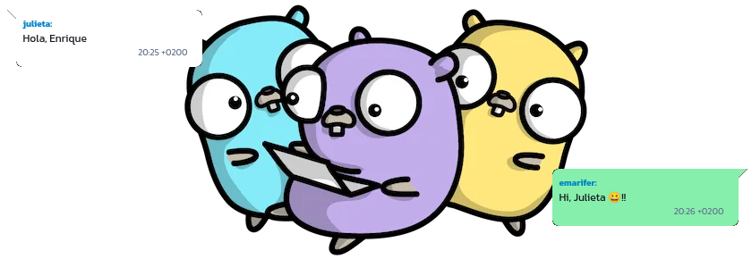
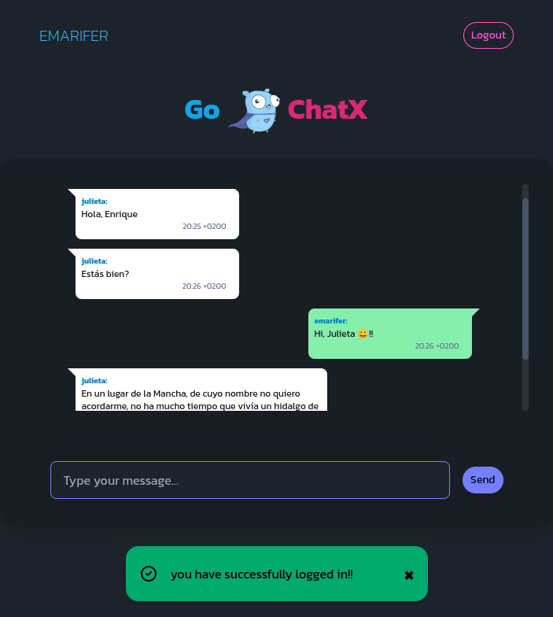
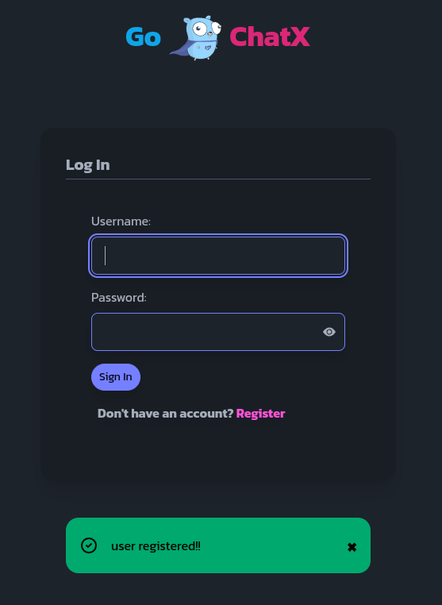
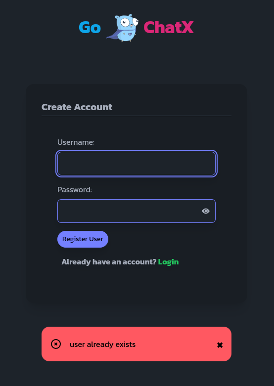
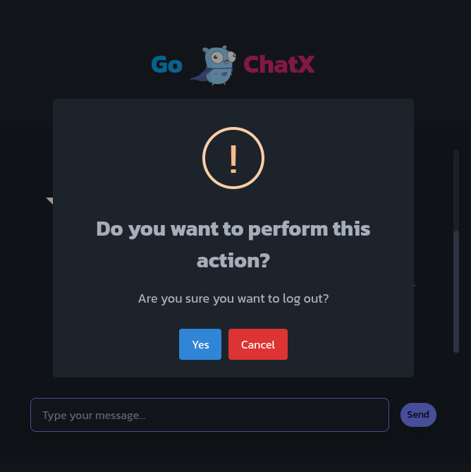

<div align="center">

# Real-time chat full-stack web application written in golang based on websocket, with Fiber framework and HTMX-powered frontend.



<br />

 

</div>

<br />

<hr />

### Features 🚀

- [x] **Using the Fiber Framework:** An Express-inspired web framework. Is a Go web framework built on top of Fasthttp with zero memory allocation and performance in mind, as stated in their documentation. We use it here because it is honestly extremely easy to build an app from scratch with it.
- [x] **Using websocket for real-time connection:** The framework itself adds an extra to handle [websockets](https://docs.gofiber.io/contrib/websocket/) in an extraordinarily easy way, without "low-level complications", as would be the case if we used packages from the standard library. Based on Fasthttp WebSocket.
- [x] **Session-based authentication using Fiber's built-in middleware:** [Session](https://docs.gofiber.io/api/middleware/session/) middleware for Fiber. uses the Storage package to support various databases through a single interface. The default configuration for this middleware saves data to memory. In this example uses [SQLite3 Storage](https://github.com/gofiber/storage/tree/main/sqlite3) package to persist users sessions. Storage package can create sessions table for you at init time but for the purpose of this example I created it manually expanding its structure with an "u" column to better query all user-related sessions.
- [x] **Using Go's native templating engine:** Although the `a-h/templ` [library](https://github.com/a-h/templ) allows type checking of the data we pass to our templates, I believe that even medium-sized projects the security/coding speed ratio is more favorable with native Go templates... and with zero dependencies.
- [x] **The architecture follows a typical "onion model":** each layer doesn't know about the layer above it, and each layer is responsible for a specific thing. Although the application is extremely simple, we use this pattern to illustrate its use in more complex applications. To ensure that each part of the application is initialized with its dependencies (`dependency injection`), each struct defines a constructor (the New function in this example).
- [x] **Using Tailwindcss and DaisyUI:** to style views. The developer will have to install these dependencies as stated below.
- [x] **Use of [</>htmx](https://htmx.org/):** Iallows behavior similar to that of a SPA, without page reloads when switching from one route to another or when making requests (via AJAX) to the backend. Reading Carson Gross's book [Hypermedia System](https://hypermedia.systems/) is very illuminating. On the other hand, the </>htmx response-targets [extension](https://v1.htmx.org/extensions/response-targets/) allows you to specify different target elements that will be exchanged when different HTTP response codes are received. In our case it makes it easier to replace the entire response body with the corresponding error page. Another </>htmx [extension](https://v1.htmx.org/extensions/web-sockets/) handles websocket connections from the client side.
- [x] **Minimal use of [_hyperscript](https://hyperscript.org/):** to achieve the action of closing the alerts when they are displayed or giving interactivity to the show/hide password button in its corresponding input.
- [x] **SweetAlert2 library is used:** a substitute for JavaScript pop-up boxes.
- [x] **All of these JavaScript libraries have been minified and included in the application's static files.**

---

### 🖼️ Screenshots:

<div align="center">

###### Chat room page with success alert:



###### Signup and login pages with their respective alerts for the user:

&nbsp;&nbsp;

<br>

###### Centralized handling of 500 & 404 errors:

&nbsp;&nbsp;

<br>

###### Pop-up alert based on SweetAlert2 to warn the user that they are about to log out:



<br>

</div>

---

### 👨‍🚀 Getting Started:

Besides the obvious prerequisite of having Go on your machine, you must have [Air](https://github.com/air-verse/air) installed for hot reloading when editing code.


Start the app in development mode:

```
$ air # Ctrl + C to stop the application
```

Build for production:

```
$ go build -ldflags="-s -w" -o ./bin/chatx ./cmd/chatx # ./bin/chatx to run the application / Ctrl + C to stop the application
```

If you are going to modify the templates you will need to run some NodeJs commands to make Tailwindcss rebuild the CSS code. At the root of the project you can run the following commands:

```
$ npm i --prefix web/tailwind/ # to install the dependencies

$ npm run --prefix web/tailwind/ watch-css # leave Tailwindcss running in watch mode

$ npm run --prefix web/tailwind/ build-css-prod # building minified CSS for production
```

In order to test the application on your machine you will need to have 2 browsers open so you can log in to both separately.

---

### Happy coding 😀!!
